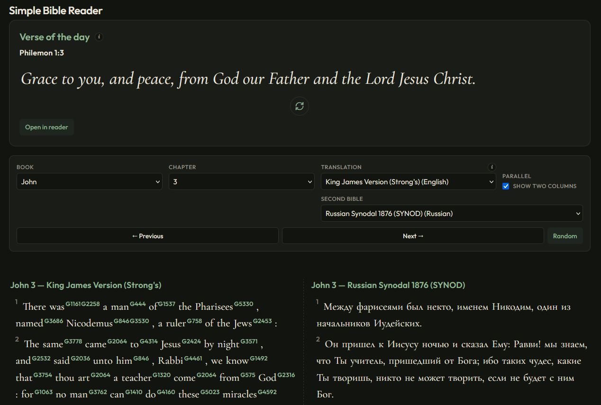

# Simple Bible Reader

Offline Bible reader: JSON under `public/bible-data/`, no runtime Bible API.



## Quick start

```bash
npm install
npm run build:bible
npm run dev
```

Use the URL Vite prints. The app needs `http://` or `https://` (not `file://`).

```bash
npm test
```

## Verse of the day (500-verse pool)

The header **Verse of the day** card uses a bundled 500-verse list (`src/votd-500.json`) plus per-tab **session** storage. To change the list, edit `scripts/votd-500-picks.mjs` and run `npm run build-votd` (needs `t-kjv.json` from `npm run build:bible` or a checked-in bundle). Full details: [docs/wiki/Verse-of-the-Day-Pool.md](docs/wiki/Verse-of-the-Day-Pool.md).

## Full documentation (wiki mirror)

Detailed guides, sources, troubleshooting, GitHub Pages, and development notes live in **`docs/wiki/`**. That folder is meant to be copied into the repo’s [GitHub Wiki](https://docs.github.com/en/communities/documenting-your-project-with-wikis) (see [Home](docs/wiki/Home.md) for publish steps).

Short pointers in repo root: `PROJECT-HANDOFF.md`, `FORK-AND-CURSOR-SETUP.md`, `CUSTOM-TRANSLATIONS.md` → each redirects into the wiki mirror.
